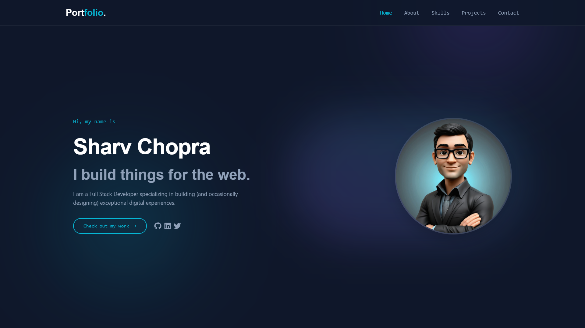
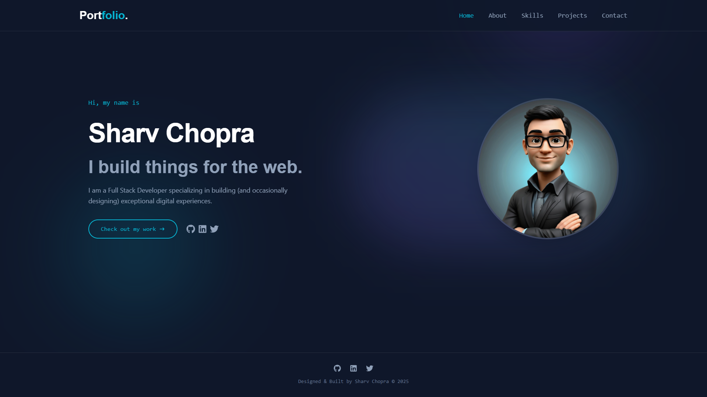

# Portfolio - Sharv Chopra

Welcome to my personal portfolio website! This project showcases my skills, experience, and the software solutions I've built.



## 🚀 Live Demo
[Link to Live Demo if available]

## ✨ Features
- **Interactive UI**: Built with React and Framer Motion for smooth animations and transitions.
- **Project Showcase**: Detailed view of my top projects with links to live demos and GitHub repositories.
- **Skills Overview**: comprehensive list of technical skills and tools.
- **Contact Form**: easy way to get in touch.
- **Responsive Design**: Optimised for all devices (Desktop, Tablet, Mobile).

## 🛠️ Tech Stack
### Frontend
- **React** (Vite)
- **Tailwind CSS**
- **Framer Motion**
- **React Icons**

### Backend
- **Node.js**
- **Express.js**
- **MongoDB**

## 📂 Projects

Here are some of the key projects featured in this portfolio:

### 1. EV-Charge
A comprehensive full-stack platform for electric vehicle route planning.
- **Tech**: React, Node.js, MongoDB
- [GitHub](https://github.com/SharvChopra/EV-Charge)

### 2. Focus-Mode
A productivity-focused app to help users eliminate distractions.
- **Tech**: React, Chrome Extension API
- [GitHub](https://github.com/SharvChopra/Focus-Mode)

### 3. PrimeCompare
AI-powered product analysis tool using Google Gemini.
- **Tech**: React, Puppeteer, Gemini AI
- [GitHub](https://github.com/SharvChopra/PrimeCompare)

### 4. AgentForce
Legal tech assistant using Large Language Models.
- **Tech**: Python, LangChain, Streamlit
- [GitHub](https://github.com/SharvChopra/AgentForce_SharvChopra)

## 📸 Screenshots



## 🔧 Installation & Setup

1. **Clone the repository**
   ```bash
   git clone https://github.com/SharvChopra/Portfolio.git
   cd Portfolio
   ```

2. **Setup Backend**
   ```bash
   cd backend
   npm install
   # Create .env file with MONGODB_URI and PORT
   node server.js
   ```

3. **Setup Frontend**
   ```bash
   cd frontend
   npm install
   npm run dev
   ```

## 📬 Contact
- **Email**: sharvchopra12@gmail.com
- **Location**: Patiala, Punjab

---
© 2024 Sharv Chopra. All Rights Reserved.
